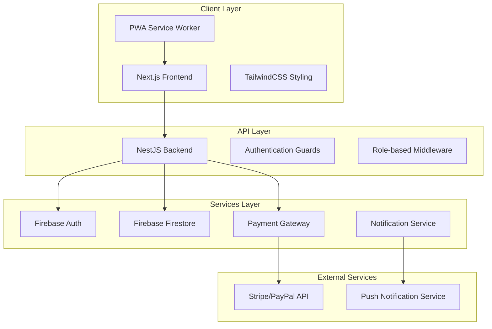

# Design Document

## Overview

The Home Management application is designed as a modern fullstack web application using a monorepo architecture. The system leverages Next.js for the frontend with server-side rendering capabilities, NestJS for a robust backend API, and Firebase services for authentication, real-time database, and hosting. The architecture emphasizes scalability, maintainability, and real-time user experience while supporting multiple languages and mobile-first design.

## Architecture

### High-Level Architecture



### Monorepo Structure

```
my-fullstack-app/
├── apps/
│   ├── client/                 # Next.js frontend
│   │   ├── pages/
│   │   ├── components/
│   │   ├── hooks/
│   │   ├── contexts/
│   │   ├── styles/
│   │   ├── public/
│   │   ├── locales/           # i18n translations
│   │   ├── .env.local         # Client environment variables
│   │   └── next.config.js
│   └── server/                # NestJS backend
│       ├── src/
│       │   ├── modules/
│       │   │   ├── auth/
│       │   │   ├── users/
│       │   │   ├── payments/
│       │   │   ├── reservations/
│       │   │   ├── meetings/
│       │   │   ├── notifications/
│       │   │   └── audit-logs/  # Payment tracking and audit logs
│       │   ├── guards/
│       │   ├── decorators/
│       │   ├── filters/
│       │   ├── config/        # Environment configuration
│       │   └── main.ts
│       ├── firebase-functions/
│       └── .env               # Server environment variables
├── libs/                      # Shared libraries
│   ├── types/                # TypeScript interfaces
│   ├── dtos/                 # Data Transfer Objects
│   ├── utils/                # Shared utilities
│   └── constants/            # Application constants
├── firebase/                  # Firebase configuration
│   └── .env.firebase         # Firebase-specific environment variables
├── .env.example              # Template for environment variables
├── .env.production           # Production environment variables
└── package.json
```

## Components and Interfaces

### Frontend Components Architecture

#### Core Layout Components
- **AppLayout**: Main application wrapper with navigation and role-based menu
- **Sidebar**: Responsive navigation with role-based menu items
- **Header**: User profile, language switcher, and notifications
- **MobileNav**: Collapsible mobile navigation

#### Feature Components
- **PaymentDashboard**: Payment overview and history for residents
- **PaymentManagement**: Administrative payment management interface
- **ReservationCalendar**: Interactive calendar for common area bookings
- **MeetingBoard**: Meeting schedules, notes, and voting interface
- **UserManagement**: User administration and role assignment
- **NotificationCenter**: Real-time notifications and alerts

#### Authentication Components
- **LoginForm**: User login interface with email and password
- **RegisterForm**: User registration interface for new accounts
- **PasswordResetForm**: Password reset interface with email input and validation
- **UserProfile**: User profile management and settings

#### Shared Components
- **DataTable**: Reusable table with sorting, filtering, and pagination
- **Modal**: Configurable modal dialogs
- **FormBuilder**: Dynamic form generation with validation
- **LoadingSpinner**: Consistent loading states
- **ErrorBoundary**: Error handling and user feedback

### Backend Module Architecture

#### Authentication Module
```typescript
interface AuthService {
  validateFirebaseToken(token: string): Promise<DecodedIdToken>
  getUserRole(uid: string): Promise<UserRole>
  createUser(userData: CreateUserDto): Promise<User>
}

interface AuthGuard {
  canActivate(context: ExecutionContext): boolean
}

interface RoleGuard {
  canActivate(context: ExecutionContext, requiredRoles: UserRole[]): boolean
}
```

#### Password Reset Component Interface
```typescript
interface PasswordResetFormProps {
  onSuccess?: () => void;
  onSwitchToLogin?: () => void;
}

interface PasswordResetFormState {
  email: string;
  loading: boolean;
  error: string | null;
  success: boolean;
}

interface PasswordResetValidation {
  email: {
    required: true;
    pattern: /^[^\s@]+@[^\s@]+\.[^\s@]+$/;
    message: string;
  }
}
```

#### User Management Module
```typescript
interface UserService {
  createUser(userData: CreateUserDto): Promise<User>
  updateUser(uid: string, updateData: UpdateUserDto): Promise<User>
  getUsersByRole(role: UserRole): Promise<User[]>
  deactivateUser(uid: string): Promise<void>
}

interface User {
  uid: string
  email: string
  displayName: string
  role: UserRole
  apartmentNumber?: string
  phoneNumber?: string
  preferredLanguage: 'es' | 'en'
  isActive: boolean
  createdAt: Date
  updatedAt: Date
}
```

#### Payment Management Module
```typescript
interface PaymentService {
  createPayment(paymentData: CreatePaymentDto): Promise<Payment>
  processPayment(paymentId: string, paymentMethod: PaymentMethod): Promise<PaymentResult>
  getPaymentHistory(userId: string): Promise<Payment[]>
  updatePaymentStatus(paymentId: string, status: PaymentStatus): Promise<Payment>
  logPaymentTransaction(transactionData: PaymentTransactionLog): Promise<void>
}

interface Payment {
  id: string
  userId: string
  amount: number
  currency: string
  description: string
  status: PaymentStatus
  dueDate: Date
  paidDate?: Date
  paymentMethod?: string
  transactionId?: string
  createdAt: Date
  updatedAt: Date
}

interface PaymentTransactionLog {
  id: string
  paymentId: string
  userId: string
  action: 'created' | 'processed' | 'failed' | 'refunded' | 'cancelled'
  provider: 'stripe' | 'paypal'
  providerTransactionId?: string
  providerResponse: any
  amount: number
  currency: string
  ipAddress: string
  userAgent: string
  timestamp: Date
  metadata?: Record<string, any>
}
```

#### Audit Logs Module
```typescript
interface AuditLogService {
  logPaymentEvent(event: PaymentAuditEvent): Promise<void>
  logUserAction(event: UserAuditEvent): Promise<void>
  logSystemEvent(event: SystemAuditEvent): Promise<void>
  getAuditLogs(filters: AuditLogFilters): Promise<AuditLog[]>
}

interface PaymentAuditEvent {
  type: 'payment_created' | 'payment_processed' | 'payment_failed' | 'payment_refunded'
  paymentId: string
  userId: string
  amount: number
  provider: string
  providerTransactionId?: string
  providerResponse?: any
  errorMessage?: string
  ipAddress: string
  userAgent: string
}
```

#### Reservation Module
```typescript
interface ReservationService {
  createReservation(reservationData: CreateReservationDto): Promise<Reservation>
  getAvailableSlots(areaId: string, date: Date): Promise<TimeSlot[]>
  cancelReservation(reservationId: string, userId: string): Promise<void>
  getReservationsByUser(userId: string): Promise<Reservation[]>
}

interface Reservation {
  id: string
  userId: string
  areaId: string
  startTime: Date
  endTime: Date
  status: ReservationStatus
  notes?: string
  createdAt: Date
  updatedAt: Date
}
```

#### Meeting Management Module
```typescript
interface MeetingService {
  createMeeting(meetingData: CreateMeetingDto): Promise<Meeting>
  publishNotes(meetingId: string, notes: string): Promise<Meeting>
  recordVote(meetingId: string, voteData: VoteDto): Promise<Vote>
  getMeetingsByDateRange(startDate: Date, endDate: Date): Promise<Meeting[]>
}

interface Meeting {
  id: string
  title: string
  description: string
  scheduledDate: Date
  agenda: string[]
  notes?: string
  status: MeetingStatus
  attendees: string[]
  votes: Vote[]
  createdBy: string
  createdAt: Date
  updatedAt: Date
}
```

## Data Models

### Firebase Firestore Collections Structure

#### Users Collection
```typescript
interface UserDocument {
  uid: string
  email: string
  displayName: string
  role: 'admin' | 'vigilance' | 'resident' | 'security'
  apartmentNumber?: string
  phoneNumber?: string
  preferredLanguage: 'es' | 'en'
  isActive: boolean
  fcmToken?: string
  createdAt: Timestamp
  updatedAt: Timestamp
}
```

#### Payments Collection
```typescript
interface PaymentDocument {
  id: string
  userId: string
  amount: number
  currency: string
  description: string
  status: 'pending' | 'paid' | 'overdue' | 'cancelled'
  dueDate: Timestamp
  paidDate?: Timestamp
  paymentMethod?: string
  transactionId?: string
  createdAt: Timestamp
  updatedAt: Timestamp
}
```

#### Payment Transaction Logs Collection
```typescript
interface PaymentTransactionLogDocument {
  id: string
  paymentId: string
  userId: string
  action: 'created' | 'processed' | 'failed' | 'refunded' | 'cancelled'
  provider: 'stripe' | 'paypal'
  providerTransactionId?: string
  providerResponse: any
  amount: number
  currency: string
  ipAddress: string
  userAgent: string
  timestamp: Timestamp
  metadata?: Record<string, any>
}
```

#### Audit Logs Collection
```typescript
interface AuditLogDocument {
  id: string
  type: 'payment' | 'user_action' | 'system_event'
  action: string
  userId?: string
  entityId?: string
  entityType?: string
  details: Record<string, any>
  ipAddress?: string
  userAgent?: string
  timestamp: Timestamp
  severity: 'info' | 'warning' | 'error' | 'critical'
}
```

#### Reservations Collection
```typescript
interface ReservationDocument {
  id: string
  userId: string
  areaId: string
  areaName: string
  startTime: Timestamp
  endTime: Timestamp
  status: 'confirmed' | 'cancelled' | 'completed'
  notes?: string
  createdAt: Timestamp
  updatedAt: Timestamp
}
```

#### Common Areas Collection
```typescript
interface CommonAreaDocument {
  id: string
  name: string
  description: string
  capacity: number
  availableHours: {
    start: string
    end: string
  }
  isActive: boolean
  rules: string[]
  createdAt: Timestamp
  updatedAt: Timestamp
}
```

#### Meetings Collection
```typescript
interface MeetingDocument {
  id: string
  title: string
  description: string
  scheduledDate: Timestamp
  agenda: string[]
  notes?: string
  status: 'scheduled' | 'completed' | 'cancelled'
  attendees: string[]
  createdBy: string
  createdAt: Timestamp
  updatedAt: Timestamp
}
```

#### Votes Subcollection (under Meetings)
```typescript
interface VoteDocument {
  id: string
  meetingId: string
  question: string
  options: string[]
  votes: {
    [userId: string]: string
  }
  results: {
    [option: string]: number
  }
  isActive: boolean
  createdAt: Timestamp
  closedAt?: Timestamp
}
```

## Error Handling

### Frontend Error Handling Strategy

#### Error Boundary Implementation
- Global error boundary to catch React component errors
- Feature-specific error boundaries for isolated error handling
- User-friendly error messages with recovery options
- Automatic error reporting to monitoring service

#### API Error Handling
```typescript
interface ApiError {
  code: string
  message: string
  details?: any
  timestamp: Date
}

interface ErrorHandler {
  handleAuthError(error: AuthError): void
  handleNetworkError(error: NetworkError): void
  handleValidationError(error: ValidationError): void
  handleServerError(error: ServerError): void
}
```

### Backend Error Handling Strategy

#### Global Exception Filter
```typescript
@Catch()
export class GlobalExceptionFilter implements ExceptionFilter {
  catch(exception: unknown, host: ArgumentsHost) {
    const ctx = host.switchToHttp()
    const response = ctx.getResponse()
    const request = ctx.getRequest()

    const status = exception instanceof HttpException 
      ? exception.getStatus() 
      : HttpStatus.INTERNAL_SERVER_ERROR

    const errorResponse = {
      statusCode: status,
      timestamp: new Date().toISOString(),
      path: request.url,
      message: exception.message || 'Internal server error'
    }

    response.status(status).json(errorResponse)
  }
}
```

#### Custom Exception Classes
- `PaymentProcessingException`: Payment-related errors
- `ReservationConflictException`: Booking conflicts
- `UnauthorizedAccessException`: Role-based access violations
- `ValidationException`: Input validation errors

## Environment Configuration and Security

### Environment Variables Management

#### Client-Side Environment Variables (.env.local)
```bash
# Next.js Client Configuration
NEXT_PUBLIC_FIREBASE_API_KEY=your_firebase_api_key
NEXT_PUBLIC_FIREBASE_AUTH_DOMAIN=your_project.firebaseapp.com
NEXT_PUBLIC_FIREBASE_PROJECT_ID=your_project_id
NEXT_PUBLIC_FIREBASE_STORAGE_BUCKET=your_project.appspot.com
NEXT_PUBLIC_FIREBASE_MESSAGING_SENDER_ID=your_sender_id
NEXT_PUBLIC_FIREBASE_APP_ID=your_app_id
NEXT_PUBLIC_FIREBASE_MEASUREMENT_ID=your_measurement_id

# API Configuration
NEXT_PUBLIC_API_BASE_URL=http://localhost:3001/api
NEXT_PUBLIC_STRIPE_PUBLISHABLE_KEY=pk_test_your_stripe_key

# PWA Configuration
NEXT_PUBLIC_VAPID_PUBLIC_KEY=your_vapid_public_key
```

#### Server-Side Environment Variables (.env)
```bash
# Firebase Admin Configuration
FIREBASE_PROJECT_ID=your_project_id
FIREBASE_CLIENT_EMAIL=your_service_account_email
FIREBASE_PRIVATE_KEY=your_private_key
FIREBASE_DATABASE_URL=https://your_project.firebaseio.com

# Payment Gateway Configuration
STRIPE_SECRET_KEY=sk_test_your_stripe_secret_key
STRIPE_WEBHOOK_SECRET=whsec_your_webhook_secret
PAYPAL_CLIENT_ID=your_paypal_client_id
PAYPAL_CLIENT_SECRET=your_paypal_client_secret
PAYPAL_WEBHOOK_ID=your_paypal_webhook_id

# Application Configuration
JWT_SECRET=your_jwt_secret_key
ENCRYPTION_KEY=your_encryption_key
API_PORT=3001
NODE_ENV=development

# Notification Services
FCM_SERVER_KEY=your_fcm_server_key
VAPID_PRIVATE_KEY=your_vapid_private_key

# Logging and Monitoring
LOG_LEVEL=info
SENTRY_DSN=your_sentry_dsn
```

#### Production Environment Variables (.env.production)
```bash
# Production Firebase Configuration
FIREBASE_PROJECT_ID=your_production_project_id
FIREBASE_CLIENT_EMAIL=your_production_service_account_email
FIREBASE_PRIVATE_KEY=your_production_private_key

# Production Payment Configuration
STRIPE_SECRET_KEY=sk_live_your_live_stripe_key
PAYPAL_CLIENT_ID=your_live_paypal_client_id
PAYPAL_CLIENT_SECRET=your_live_paypal_client_secret

# Production Security
JWT_SECRET=your_production_jwt_secret
ENCRYPTION_KEY=your_production_encryption_key
API_PORT=443
NODE_ENV=production
```

### Configuration Service Implementation

```typescript
@Injectable()
export class ConfigService {
  private readonly config: Record<string, string>

  constructor() {
    this.config = {
      // Firebase Configuration
      firebaseProjectId: process.env.FIREBASE_PROJECT_ID,
      firebaseClientEmail: process.env.FIREBASE_CLIENT_EMAIL,
      firebasePrivateKey: process.env.FIREBASE_PRIVATE_KEY?.replace(/\\n/g, '\n'),
      
      // Payment Configuration
      stripeSecretKey: process.env.STRIPE_SECRET_KEY,
      stripeWebhookSecret: process.env.STRIPE_WEBHOOK_SECRET,
      paypalClientId: process.env.PAYPAL_CLIENT_ID,
      paypalClientSecret: process.env.PAYPAL_CLIENT_SECRET,
      
      // Security Configuration
      jwtSecret: process.env.JWT_SECRET,
      encryptionKey: process.env.ENCRYPTION_KEY,
      
      // Application Configuration
      apiPort: process.env.API_PORT || '3001',
      nodeEnv: process.env.NODE_ENV || 'development',
    }

    this.validateConfig()
  }

  get(key: string): string {
    const value = this.config[key]
    if (!value) {
      throw new Error(`Configuration key "${key}" is not defined`)
    }
    return value
  }

  private validateConfig(): void {
    const requiredKeys = [
      'firebaseProjectId',
      'firebaseClientEmail',
      'firebasePrivateKey',
      'stripeSecretKey',
      'jwtSecret',
      'encryptionKey'
    ]

    const missingKeys = requiredKeys.filter(key => !this.config[key])
    
    if (missingKeys.length > 0) {
      throw new Error(`Missing required configuration keys: ${missingKeys.join(', ')}`)
    }
  }
}
```

### Payment Logging and Audit Trail

#### Payment Transaction Logging Strategy

```typescript
@Injectable()
export class PaymentAuditService {
  constructor(
    private firestore: FirebaseFirestore,
    private configService: ConfigService
  ) {}

  async logPaymentTransaction(transactionData: PaymentTransactionLog): Promise<void> {
    try {
      const logEntry = {
        ...transactionData,
        timestamp: FieldValue.serverTimestamp(),
        environment: this.configService.get('nodeEnv'),
        version: process.env.npm_package_version || '1.0.0'
      }

      await this.firestore
        .collection('payment_transaction_logs')
        .doc(transactionData.id)
        .set(logEntry)

      // Also log to external monitoring service if configured
      if (this.configService.get('nodeEnv') === 'production') {
        await this.logToExternalService(logEntry)
      }
    } catch (error) {
      console.error('Failed to log payment transaction:', error)
      // Don't throw error to avoid breaking payment flow
    }
  }

  async logThirdPartyResponse(
    paymentId: string,
    provider: 'stripe' | 'paypal',
    response: any,
    success: boolean
  ): Promise<void> {
    const logData = {
      id: `${paymentId}_${provider}_${Date.now()}`,
      paymentId,
      provider,
      response: this.sanitizeResponse(response),
      success,
      timestamp: new Date(),
      ipAddress: this.getClientIP(),
      userAgent: this.getUserAgent()
    }

    await this.logPaymentTransaction(logData as PaymentTransactionLog)
  }

  private sanitizeResponse(response: any): any {
    // Remove sensitive data from third-party responses
    const sanitized = { ...response }
    
    // Remove sensitive fields
    delete sanitized.client_secret
    delete sanitized.payment_method_details?.card?.fingerprint
    delete sanitized.billing_details
    
    return sanitized
  }

  private async logToExternalService(logEntry: any): Promise<void> {
    // Integration with external logging service (e.g., Sentry, LogRocket)
    // This ensures payment logs are also available outside Firebase
  }
}
```

#### Audit Log Queries and Reporting

```typescript
@Injectable()
export class AuditReportService {
  constructor(private firestore: FirebaseFirestore) {}

  async getPaymentAuditReport(
    startDate: Date,
    endDate: Date,
    userId?: string
  ): Promise<PaymentAuditReport> {
    let query = this.firestore
      .collection('payment_transaction_logs')
      .where('timestamp', '>=', startDate)
      .where('timestamp', '<=', endDate)

    if (userId) {
      query = query.where('userId', '==', userId)
    }

    const snapshot = await query.get()
    const logs = snapshot.docs.map(doc => doc.data() as PaymentTransactionLogDocument)

    return {
      totalTransactions: logs.length,
      successfulTransactions: logs.filter(log => log.action === 'processed').length,
      failedTransactions: logs.filter(log => log.action === 'failed').length,
      totalAmount: logs.reduce((sum, log) => sum + log.amount, 0),
      providerBreakdown: this.getProviderBreakdown(logs),
      logs
    }
  }

  private getProviderBreakdown(logs: PaymentTransactionLogDocument[]): Record<string, number> {
    return logs.reduce((breakdown, log) => {
      breakdown[log.provider] = (breakdown[log.provider] || 0) + 1
      return breakdown
    }, {} as Record<string, number>)
  }
}
```

## Testing Strategy

### Frontend Testing Approach

#### Unit Testing
- **Jest + React Testing Library**: Component unit tests
- **MSW (Mock Service Worker)**: API mocking for isolated testing
- **Coverage Target**: 80% code coverage for components and utilities

#### Integration Testing
- **Cypress**: End-to-end user journey testing
- **Test Scenarios**: 
  - User authentication flows
  - Payment processing workflows
  - Reservation booking processes
  - Meeting management workflows

#### Accessibility Testing
- **axe-core**: Automated accessibility testing
- **Manual Testing**: Screen reader compatibility
- **WCAG 2.1 AA Compliance**: Target accessibility standard

### Backend Testing Approach

#### Unit Testing
- **Jest**: Service and controller unit tests
- **Test Doubles**: Mocking Firebase services and external APIs
- **Coverage Target**: 85% code coverage for business logic

#### Integration Testing
- **Supertest**: API endpoint testing
- **Firebase Emulator**: Local Firebase testing environment
- **Test Database**: Isolated test data for integration tests

#### Performance Testing
- **Artillery**: Load testing for API endpoints
- **Firebase Performance Monitoring**: Real-time performance tracking
- **Metrics**: Response time, throughput, and error rates

### Password Reset Localization

#### New Translation Keys Required

**English** (`apps/client/public/locales/en/common.json`):
```json
{
  "auth": {
    "resetPasswordEmailLabel": "Email Address",
    "resetPasswordEmailPlaceholder": "Enter your email address",
    "sendResetEmail": "Send Reset Email",
    "sendingResetEmail": "Sending...",
    "resetEmailSent": "Password reset email sent successfully",
    "resetEmailSentDescription": "If an account with that email exists, you will receive password reset instructions shortly.",
    "resetEmailError": "Failed to send reset email. Please try again.",
    "emailRequired": "Email address is required",
    "emailInvalid": "Please enter a valid email address"
  }
}
```

**Spanish** (`apps/client/public/locales/es/common.json`):
```json
{
  "auth": {
    "resetPasswordEmailLabel": "Dirección de Correo Electrónico",
    "resetPasswordEmailPlaceholder": "Ingrese su dirección de correo electrónico",
    "sendResetEmail": "Enviar Correo de Restablecimiento",
    "sendingResetEmail": "Enviando...",
    "resetEmailSent": "Correo de restablecimiento enviado exitosamente",
    "resetEmailSentDescription": "Si existe una cuenta con ese correo electrónico, recibirá instrucciones de restablecimiento de contraseña en breve.",
    "resetEmailError": "Error al enviar el correo de restablecimiento. Intente nuevamente.",
    "emailRequired": "La dirección de correo electrónico es requerida",
    "emailInvalid": "Por favor ingrese una dirección de correo electrónico válida"
  }
}
```

### Testing Data Management
```typescript
interface TestDataFactory {
  createTestUser(role: UserRole): User
  createTestPayment(userId: string): Payment
  createTestReservation(userId: string, areaId: string): Reservation
  createTestMeeting(createdBy: string): Meeting
}
```

### Continuous Integration Testing
- **GitHub Actions**: Automated test execution on pull requests
- **Test Environments**: Staging environment for integration testing
- **Quality Gates**: Tests must pass before deployment
- **Security Scanning**: Dependency vulnerability checks